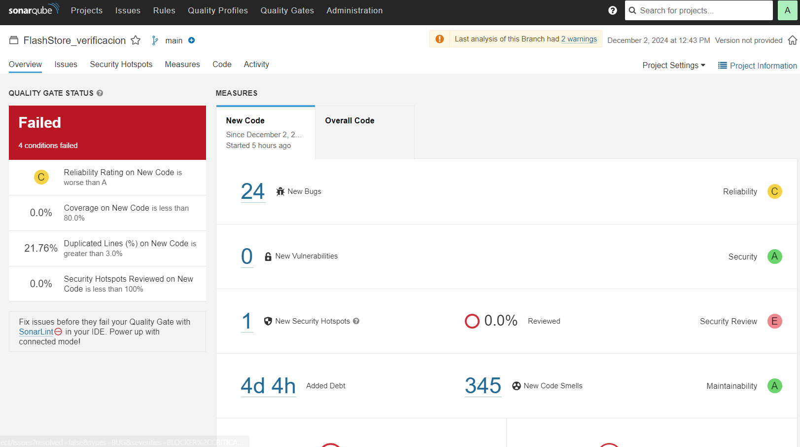
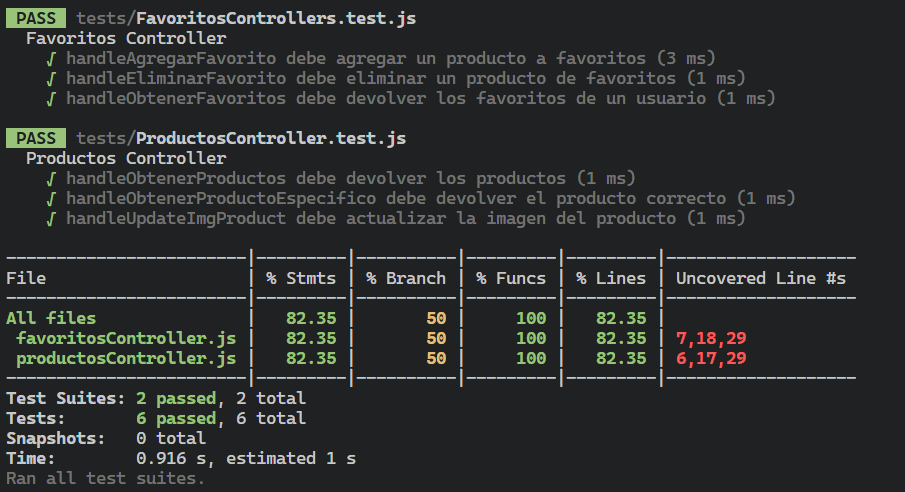
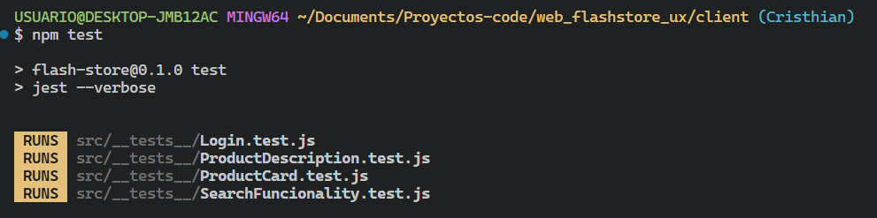
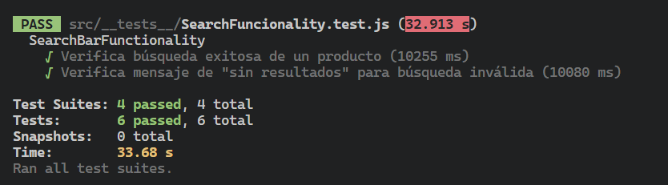

# FlashStore - Grupo 5
- **Fecha**: 02/12/2024
- **Versión**: v1.20

## Grupo 6 - Integrantes:
 - Anaya Sánchez, Eros
 - Lopez Salinas, Marco Antonio
 - Marchena Tejada, Chesney Taichi
 - Atuncar Yataco, Cristhian Paolo
 - Neira Carquin Rogger Kevin
 - Alejandro Santaria, Gian
 - Layme Moya, Victor

# README - Web flash Store
## Propósito del proyecto
El propósito de proyecto, es realizar un ecommerce para una tienda de smartphones, tablets, accesorios, etc.
Este proyecto está construido con React para el frontend y Node.js con Express para el backend. Utiliza MySQL como base de datos para gestionar la información de los productos, usuarios y pedidos.

## Objetivo
Crear una plataforma funcional para la compra y venta de productos, asegurando la calidad mediante la integración de herramientas de construcción automática, análisis estático, pruebas unitarias, funcionales y de seguridad.

## Funcionalidades principales


## Integración con Jenkins:

### Construcción automática
**Herramienta/Framework:** React (frontend) y Node.js (backend)

#### Comandos:
```bash
npm install
npm run build
```

#### Integración con Jenkins:
```groovy
stage('Build') {
    parallel {
        stage('Frontend Build') {
            steps {
                dir('client') {
                    bat 'npm install'
                    bat 'npm run build'
                }
            }
        }
        stage('Backend Build') {
            steps {
                dir('server') {
                    bat 'npm install'
                }
            }
        }
    }
}
```

---

### Análisis estático
**Herramienta/Framework:** SonarQube - Sonar Scanner

#### Evidencia:


#### Integración con Jenkins:
```groovy
stage('SonarQube Analysis ') {
    steps {
        bat "$SCANNER_HOME/bin/sonar-scanner -Dsonar.url=http://localhost:9000/ \
        -Dsonar.login=squ_676343b0b6f1e9e1ee971e1da8b6c703b334b322 \
        -Dsonar.projectKey=FlashStore \
        -Dsonar.projectName=FlashStore \
        -Dsonar.sources=. "
    }
}
```

---

### Pruebas unitarias
**Herramienta/Framework:** Jest para Node.js

#### Evidencia:
```javascript
  test('handleAgregarFavorito debe agregar un producto a favoritos', async () => {
    agregarFavorito.mockImplementation((usuario_id, producto_id, callback) => callback(null, { usuario_id, producto_id }));

    const req = { body: { usuario_id: 1, producto_id: 1 } };
    await handleAgregarFavorito(req, res);

    expect(res.status).toHaveBeenCalledWith(200);
    expect(res.send).toHaveBeenCalledWith({
      message: 'Producto agregado a favoritos',
      results: { usuario_id: 1, producto_id: 1 }
    });
  });

```


#### Integración con Jenkins:
```groovy
stage('Run Unit Tests') {
    steps {
        script {
            dir('server') {
                bat 'npm test'
            }
        }
    }
}
```

---

### Pruebas Funcionales

**Herramienta/Framework:** Selenium y Jest

#### Evidencia:
```javascript
describe('ProductDescription', () => {
  let driver;

  jest.setTimeout(15000);

  beforeAll(async () => {
    driver = await new Builder().forBrowser(Browser.CHROME).build();
    await driver.get('http://localhost:3000/product/19'); // Producto de ejemplo
  });

  afterAll(async () => {
    await driver.quit();
  });

  const esperarLoader = async (selector, timeout = 10000) => {
    const elemento = await driver.wait(until.elementLocated(By.css(selector)), timeout);
    await driver.wait(until.elementIsVisible(elemento), timeout);
    return elemento;
  };

  it('Verifica la notificación después de añadir al carrito', async () => {
    try {
      await esperarLoader('.background-loader');

      const addToCartButton = await driver.wait(until.elementLocated(By.css('.add-to-car')), 5000);

      await addToCartButton.click();

      const notification = await esperarLoader('.notification-cart', 5000);
      const notificationText = await notification.getText();
      strictEqual(notificationText, 'Producto añadido al carrito');
    } catch (error) {
      console.log('Error al interactuar con el botón de agregar al carrito o la notificación:', error);
    }
  });
});
```



#### Integración con Jenkins:
```groovy
stage('Run Functional Tests') {
    steps {
        script {
            dir('client') {
                bat 'npm test'
            }
        }
    }
}
```

---

### Pruebas de Rendimiento

**Herramienta:** Apache JMeter

#### Evidencia:
```xml
<?xml version="1.0" encoding="UTF-8"?>
<jmeterTestPlan version="1.2" properties="5.0" jmeter="5.6.3">
  <hashTree>
    <TestPlan guiclass="TestPlanGui" testclass="TestPlan" testname="Test Plan">
      <elementProp name="TestPlan.user_defined_variables" elementType="Arguments" guiclass="ArgumentsPanel" testclass="Arguments" testname="User Defined Variables">
        <collectionProp name="Arguments.arguments"/>
      </elementProp>
    </TestPlan>
    <hashTree>
      <ThreadGroup guiclass="ThreadGroupGui" testclass="ThreadGroup" testname="Productos">
        <intProp name="ThreadGroup.num_threads">10</intProp>
        <intProp name="ThreadGroup.ramp_time">2</intProp>
        <boolProp name="ThreadGroup.same_user_on_next_iteration">true</boolProp>
        <stringProp name="ThreadGroup.on_sample_error">continue</stringProp>
        <elementProp name="ThreadGroup.main_controller" elementType="LoopController" guiclass="LoopControlPanel" testclass="LoopController" testname="Loop Controller">
          <stringProp name="LoopController.loops">1</stringProp>
          <boolProp name="LoopController.continue_forever">false</boolProp>
        </elementProp>
      </ThreadGroup>
      <hashTree>
        <HTTPSamplerProxy guiclass="HttpTestSampleGui" testclass="HTTPSamplerProxy" testname="Listar Productos">
          <stringProp name="HTTPSampler.domain">localhost</stringProp>
          <stringProp name="HTTPSampler.port">8000</stringProp>
          <stringProp name="HTTPSampler.protocol">http</stringProp>
          <stringProp name="HTTPSampler.path">api/productos/productos</stringProp>
          <boolProp name="HTTPSampler.follow_redirects">true</boolProp>
          <stringProp name="HTTPSampler.method">GET</stringProp>
          <boolProp name="HTTPSampler.use_keepalive">true</boolProp>
          <boolProp name="HTTPSampler.postBodyRaw">false</boolProp>
          <elementProp name="HTTPsampler.Arguments" elementType="Arguments" guiclass="HTTPArgumentsPanel" testclass="Arguments" testname="User Defined Variables">
            <collectionProp name="Arguments.arguments"/>
          </elementProp>
        </HTTPSamplerProxy>
      </hashTree>
    </hashTree>
  </hashTree>
</jmeterTestPlan>
```

#### Integración con Jenkins:
```groovy
environment {
        JMETERT_HOME = 'C:\\Users\\USUARIO\\Documents\\apache-jmeter-5.6.3'
        JMX_FILE = 'performance-test.jmx'
        RESULTS_DIR = 'jmeter-results'
}
stage('Run Performance Tests') {
    
    steps {
        script {
            def timestamp = new Date().format("yyyyMMdd_HHmmss")
            def resultsFile = "${WORKSPACE}\\${RESULTS_DIR}\\results_${timestamp}.jtl"
            def reportDir = "${WORKSPACE}\\${RESULTS_DIR}\\report_${timestamp}"

            bat """
                 ${JMETERT_HOME}\\bin\\jmeter -n -t ${WORKSPACE}\\${JMX_FILE} -l ${resultsFile} -e -o ${reportDir}
            """

            publishHTML(target: [
                reportName: 'JMeter Report',
                reportDir: reportDir,
                reportFiles: 'index.html',
                keepAll: true
            ])
        }
    }
}
```

---

### Pruebas de Seguridad

#### Evidencia:

---

### Gestión de GitHub Issues

#### Github Proyects:
[Repositorio de Issues en GitHub](https://github.com/users/Cristh715/projects/2)

#### Evidencia:


